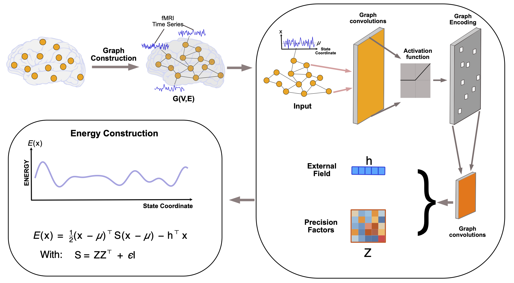

# Continuous Energy Landscape (CEL) Model for Analyzing Brain State Transitions

We propose a **Continuous Energy Landscape (CEL)** model for analyzing brain state transitions, which replaces discrete Ising-style energy landscapes with a **continuous quadratic energy** over multivariate neural activity. The energy landscape is parameterized by a **graph neural network (GNN)** that learns a positive-definite precision matrix from functional connectivity, allowing us to capture smooth, high-dimensional state transitions without binarizing the data.

This repository contains Python code for:

- Fitting the **continuous energy landscape (CEL)** model on neural time series
- Comparing against a **discrete maximum-entropy (Ising) energy landscape (DEL)** baseline
- Computing evaluation metrics (BR, TMA, SDA) on **simulated SLDS** and **Kuramoto-BOLD** data
- Reproducing key behaviors described in the accompanying paper

---

## Pipeline

The full pipeline of the proposed method, including graph construction, GCN-based precision learning, and energy landscape analysis, is illustrated in the following figure from the paper:




---

## Acknowledgement

If you use this code, please cite the following paper:

```
Triet M. Tran, Seyed Majid Razavi, Dee H. Wu, and Sina Khanmohammadi. "Continuous Energy Landscape Model for Analyzing Brain State Transitions." arXiv:2601.06991 (2026)
```
arXiv Link [https://doi.org/10.48550/arXiv.2601.06991](https://arxiv.org/abs/2601.06991).

---

## Authors

1. <strong>Triet M Tran:</strong>   </a> <a href="https://scholar.google.com/citations?user=T-W28vYAAAAJ&hl=en" target="_blank">
         
2. <strong>Sina Khanmohammadi:</strong>  </a> <a href="https://scholar.google.co.uk/citations?hl=en&user=K6sMFj4AAAAJ&view_op=list_works&sortby=pubdate" target="_blank">
        

---

## Instructions

### Installation

1. **Prerequisites**

   Make sure you have:

   - Python 3.8 or later
   - Recommended libraries:

     ```bash
     numpy
     scipy
     scikit-learn
     torch
     matplotlib
     tqdm
     jupyter
     ```

2. **Clone the repository**

   ```bash
   git clone https://github.com/3sigmalab/ContinuousEnergyLandscape.git
   cd ContinuousEnergyLandscape
   ```

3. **Install dependencies**

   Using `pip` (optionally inside a virtualenv or conda environment):

   ```bash
   pip install -r requirements.txt
   ```

   A minimal `requirements.txt` could contain:

   ```text
   numpy
   scipy
   scikit-learn
   torch
   torch-geometric
   matplotlib
   tqdm
   jupyter
   ```

Adjust the dependency list as needed for your environment.

---

## Run Experiments

This repository is organized around three main types of experiments:

1. A **simple Gaussian example** to illustrate CEL fitting
2. An **SLDS (switching VAR) example** comparing CEL vs DEL
3. A **Kuramoto-BOLD example** comparing CEL vs DEL

All examples are provided as Jupyter notebooks in the `examples/` directory.

### 1. Continuous Gaussian example

Notebook:

```text
examples/example_continuous_energy_landscape.ipynb
```

This notebook:

- Generates synthetic Gaussian time series data
- Fits the CEL model using `continuous_energy_landscape.py`
- Computes energies for each time point
- Prints simple covariance fit metrics

Run with:

```bash
jupyter notebook examples/example_continuous_energy_landscape.ipynb
```

Then execute all cells.

### 2. SLDS example: CEL vs DEL

Notebook:

```text
examples/example_slds_cel_vs_del.ipynb
```

This notebook:

1. Simulates a **switching VAR (SLDS-like)** process using `simulations/slds_sim.py`
2. Fits a **discrete energy landscape (DEL)** on binarized data via `discrete_energy.py`
3. Fits the **continuous energy landscape (CEL)** model via `continuous_energy_landscape.py`
4. Uses k-means clustering on features from each method to recover discrete states
5. Computes **BR (basin recovery), TMA (transition matrix agreement), and SDA (state distance alignment)** via `metrics_energy_landscape.py`

Run with:

```bash
jupyter notebook examples/example_slds_cel_vs_del.ipynb
```

### 3. Kuramoto-BOLD example: CEL vs DEL

Notebook:

```text
examples/example_kuramoto_cel_vs_del.ipynb
```

This notebook:

1. Simulates **BOLD-like signals** from a Kuramoto + hemodynamic model using `simulations/kuramoto_sim.py`
2. Fits DEL on binarized ROIs (with a modest number of ROIs so exact MEM is tractable)
3. Fits CEL on the continuous BOLD signals
4. Recovers hidden regimes via k-means clustering
5. Evaluates **BR, TMA, SDA** as in the SLDS example

Run with:

```bash
jupyter notebook examples/example_kuramoto_cel_vs_del.ipynb
```

---

## Minimal CEL Usage

To fit the CEL model on your own data (time series `X` of shape `(T, D)`):

```python
import numpy as np
from continuous_energy_landscape import ContinuousEnergyLandscape

# X: numpy array, shape (T, D)
cel = ContinuousEnergyLandscape(
    hidden_channels=64,
    rank=32,
    delta=0.10,
    eps=1e-2,
    lambda_reg=1e-2,
    lr=1e-3,
    weight_decay=0.0,
    max_epochs=300,
    clip_grad=1.0,
    verbose=True,
    device="cpu",   # or "cuda"
    seed=0,
)

out = cel.fit(X)
E  = cel.predict_energy(X)   # shape (T,)
print("Best training loss:", out["best_loss"])
print("Covariance fit metrics:", out["metrics"])
```

---

## Analyze Results: BR, TMA, SDA

We provide a unified interface for computing basin recovery, transition matrix agreement, and state distance alignment in:

```text
metrics_energy_landscape.py
```

Example usage:

```python
from metrics_energy_landscape import compute_metrics_all

metrics = compute_metrics_all(
    g_true,   # true discrete states, shape (T,)
    g_hat,    # inferred states (from CEL or DEL), shape (T,)
    K=K,      # number of states
    P_true=P_true,  # true transition matrix, shape (K, K)
    X=X,      # time series used for inference, shape (T, D)
)

print(metrics)  # {'BR_ARI': ..., 'TMA': ..., 'SDA': ...}
```

- **BR (Basin Recovery / ARI)** – Adjusted Rand Index between true and inferred discrete states  
- **TMA (Transition Matrix Agreement)** – similarity between Markov transition matrices  
- **SDA (State Distance Alignment)** – correlation between pairwise distances of state centroids

These metrics are used in both the SLDS and Kuramoto examples to compare **CEL vs DEL**.

---

## Code Structure

A typical repository layout is:

```text
ContinuousEnergyLandscape/
  README.md
  LICENSE
  requirements.txt

  continuous_energy_landscape.py      # continuous energy + GCN model
  discrete_energy.py                  # Ising / MEM baseline
  metrics_energy_landscape.py         # BR, TMA, SDA

  simulations/
    slds_sim.py                       # SLDS-like switching VAR simulator
    kuramoto_sim.py                   # Kuramoto + hemodynamic BOLD simulator

  examples/
    example_continuous_energy_landscape.ipynb
    example_slds_cel_vs_del.ipynb
    example_kuramoto_cel_vs_del.ipynb

  figs/
    pipeline_GCN_energy_updated.pdf   # pipeline figure from the paper
```

### Main modules

- **`continuous_energy_landscape.py`**  
  Core CEL model:
  - GNN parameterization of a positive-definite precision matrix
  - Gaussian negative log-likelihood training
  - Energy computation `E(x) = 0.5 (x - μ)^T S (x - μ)` with μ = S⁻¹h
  - Methods: `fit`, `predict_energy`, `evaluate`

- **`discrete_energy.py`**  
  Discrete maximum-entropy (Ising) baseline:
  - Binarization utilities
  - Exact MEM fitting for modest numbers of ROIs
  - Discrete energy time series computation

- **`metrics_energy_landscape.py`**  
  Evaluation metrics:
  - `estimate_transition_matrix`
  - `basin_recovery_ari` (BR)
  - `transition_matrix_agreement` (TMA)
  - `state_distance_alignment` (SDA)
  - `compute_metrics_all` (wrapper)

- **`simulations/slds_sim_simple.py`**  
  Minimal **switching VAR (SLDS-like)** simulator:
  - Multiple scenarios (e.g., different means, different covariance orientations, nonlinear observations)
  - Helper `simulate_slds_example` returning `(sim, X, g_true)`

- **`simulations/kuramoto_sim_simple.py`**  
  **Kuramoto + hemodynamic** simulator:
  - Graph-coupled phase dynamics
  - Hemodynamic smoothing to generate BOLD-like signals
  - Helper `simulate_kuramoto_example` returning `(sim, X_bold, g_true)`

- **`examples/`**  
  - `example_continuous_energy_landscape.ipynb` – simple CEL fit on synthetic Gaussian data  
  - `example_slds_cel_vs_del.ipynb` – SLDS example, CEL vs DEL, with BR/TMA/SDA  
  - `example_kuramoto_cel_vs_del.ipynb` – Kuramoto-BOLD example, CEL vs DEL, with BR/TMA/SDA  

---

## Customization

- **Model hyperparameters**  
  Adjust in `ContinuousEnergyLandscape`:
  - `hidden_channels`, `rank` – capacity of the latent GNN
  - `delta` – threshold for defining the signed graph from correlations
  - `eps` – diagonal jitter to keep `S` positive-definite
  - `lambda_reg` – Frobenius regularization for `S`
  - `max_epochs`, `lr`, `weight_decay`, `clip_grad` – training settings

- **Simulation settings**  
  In `simulations/slds_sim_simple.py` and `simulations/kuramoto_sim_simple.py`, you can change:
  - Number of ROIs (`d`)
  - Number of states (`K`)
  - Dwell times, noise levels, coupling strengths
  - Scenario types (e.g., nonlinear observations, covariance-only differences)

- **Metrics & clustering**  
  In the example notebooks, you can:
  - Replace k-means with any clustering method
  - Change the feature set for state inference (e.g., add more features from CEL)

---

## References

1. Masuda, N., Islam, S., Thu Aung, S., & Watanabe, T.  
   *Energy landscape analysis based on the Ising model: Tutorial review.*  
   PLOS Complex Systems, 2025, 2.5: e0000039.

2. Ezaki, T., Watanabe, T., Ohzeki, M., & Masuda, N.
   *Energy landscape analysis of neuroimaging data.*  
   Philosophical Transactions of the Royal Society A: Mathematical, Physical and Engineering Sciences, 375(2096), 20160287.
